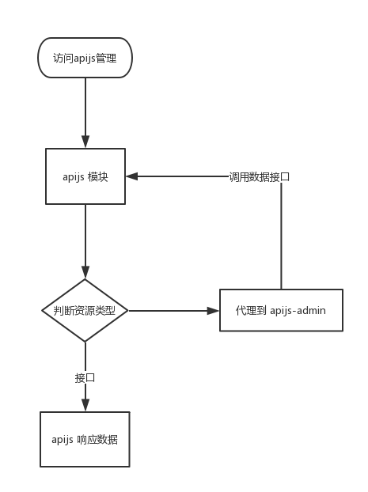

# Apijs后台管理

### 简介

基于`webpack`、`vue`、`element-ui`打造的`apijs`后台管理服务页面, 只是静态文件, 数据接口依赖于 [apijs](https://github.com/apijs/apijs) , 发布在npm, `apijs`把渲染层指向该模块达到前后端分离, 如:



## 数据接口 - 依赖apijs

- [获取所有分组 - /admin/api/group](./docs/api-group.md)
- [获取接口列表 - /admin/api/list](./docs/api-list.md)
- [创建接口 - /admin/api/add](./docs/api-add.md)
- [更新接口 - /admin/api/update](./docs/api-update.md)
- [获取接口详情 - /admin/api/](./docs/api-get.md)

## 使用

```
var serveStatic = require('serve-static');
var apijsAdmin = require('apijs-admin');

// 获取静态目录
var staticDir = apijsAdmin.getPath('static');

// 把/admin代理到apijs-admin
express.use('/admin', staticDir);
```

## 注意问题

1. 由于静态是由`webpack`打包, 而在打包时就需要指定目录, 所以后台只能是`/admin/*`
2. 使用`prepublish: release`达到发npm前打包, 通过`.gitignore`和`.npmignore`配置达到:
    - /dist - 发布但不push
    - /src - push但不发布
    - /docs - 不发布